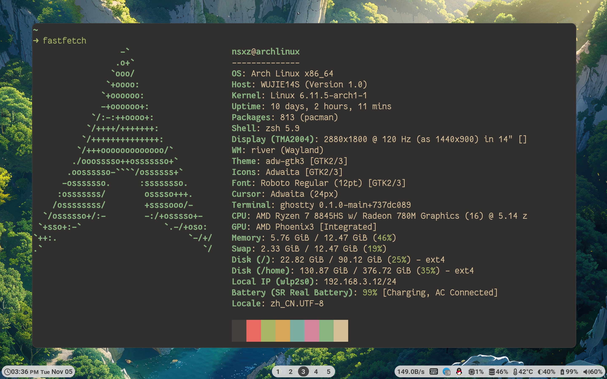
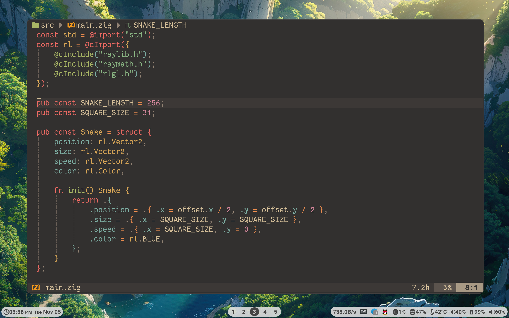

### Archlinux + RiverWM + Ghostty + Neovim





### For modifying keyboard layout:

```
xkbcli compile-keymap --layout layout --variant variant
```

Articles from blogs I read [Custom xkb layout](https://leon_plickat.srht.site/writing/custom-xkb-layout/article.html)
